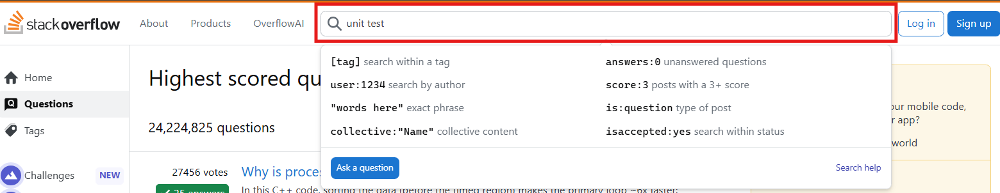
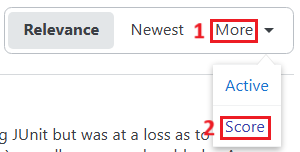
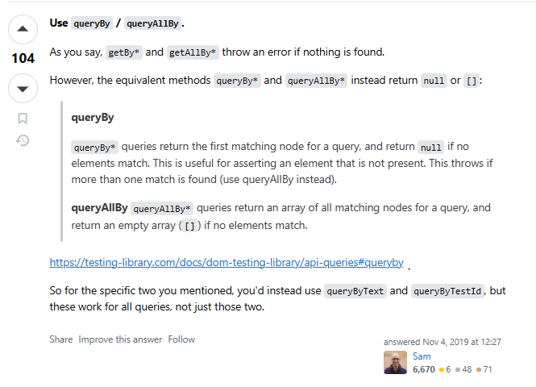
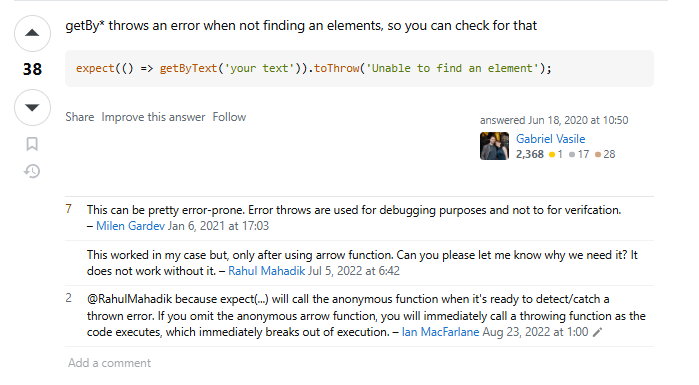
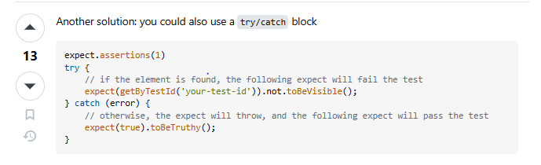
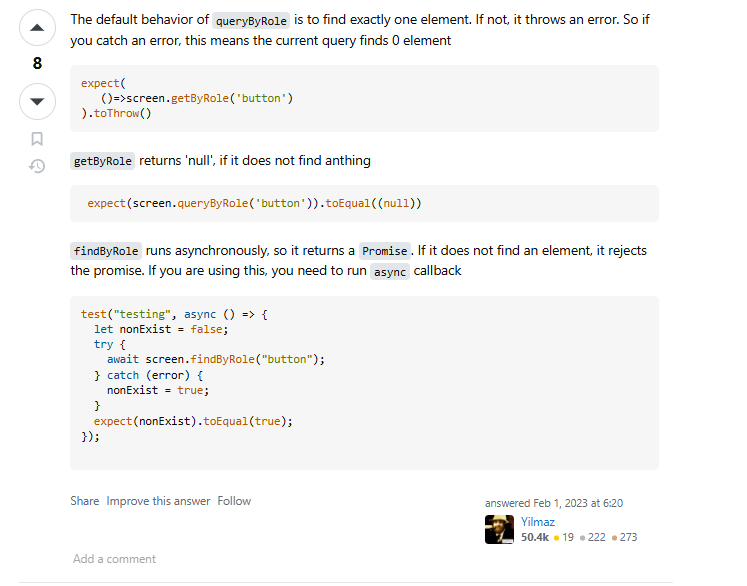

# Tutorial para Atividade 1

O tutorial faz referência a pergunta "How do you test for the non-existence of an element using jest and react-testing-library?" encontrada originalmente no [Link no Stackoverflow](https://stackoverflow.com/questions/52783144/how-do-you-test-for-the-non-existence-of-an-element-using-jest-and-react-testing).

**Integrantes do grupo:**
- Edgar de Souza Dias
- Isaac Levi Lira de Oliveira
- José Matheus Ribeiro dos Santos
- Leonardo Alexandre de Souza Barreto
- Ulisses de Jesus Cavalcante

## Etapa 1

Para este tutorial, consideraremos o [Stack Overflow](https://stackoverflow.com/questions) como nossa biblioteca de perguntas e respostas sobre desenvolvimento e programação. Nesse sentido, assumindo o objetivo de encontrar uma pergunta sobre um problema relacionado a testes de unidade com pelo menos uma resposta aceita e no mínimo 400 votos, seguiremos os passos descritos a seguir.

### Elaboração da busca

Inicialmente, após acessar a página de perguntas da biblioteca, utilizaremos a barra de busca para inserir os termos relacionados ao conteúdo desejado. Considerando o nosso objetivo, utilizaremos “unit” e “test” para encontrar resultados acerca de testes unitários, como demonstrado na figura abaixo.



Além dos termos, utilizaremos dois operadores para que a busca traga resultados específicos que satisfaçam os requisitos desejados.

| Operador | Valor | Descrição |
| --- | :---: | --- |
| `hasaccepted` | yes | Retorna apenas postagens que possuam respostas aceitas |
| `score` | 400 | Retorna apenas postagens que tenham pelo menos 400 votos |

Após unir os termos e operadores, a consulta final deve ser construída da seguinte forma:


### Filtrando resultados

Com os resultados da busca em mãos, utilizaremos um filtro para ordená-los em ordem decrescente de pontuação. Para isso, clicaremos em “*More*” e, em seguida, em “*Score*”, como destacado abaixo.



Após aplicar o filtro, escolha uma das perguntas listadas. Como foi mencionado anteriormente, para este trabalho, escolhemos a pergunta [“*How do you test for the non-existence of an element using jest and react-testing-library?*"](https://stackoverflow.com/questions/52783144/how-do-you-test-for-the-non-existence-of-an-element-using-jest-and-react-testing).

## Etapa 2

### Descrição do problema

O problema do usuário consiste em descobrir como fazer um teste unitário que verifique que a partir do estado de propriedades ou eventos um componente não está sendo renderizado em uma aplicação baseada na biblioteca `ReactJS` usando os frameworks `Jest` e a biblioteca `React-Testing-Library`.

Durante a questão ele cita sobre o uso dos métodos `getByText` e `getByTestId` que lançam erros imediatamente caso o elemento não seja encontrado. Como um erro é lançado, a execução do teste é interrompida no ponto em que a função falha. O `expect`, usado para verificar a não existência do elemento nunca é alcançado, e o teste falha com uma mensagem de erro indicando que o elemento não pôde ser encontrado, em vez de ser confirmado que ele não existe.

Portanto, para a criação do cenário da questão, foi criado um componente de formulário com 3 (três) campos, "tipo", "habilidades" e "formação". O campo de "tipo" é uma caixa de seleção (`select`) e os demais são campos de entrada (`inputs`). O campo de seleção permite a escolha entre as opções de "Professor" e "Funcionário". A alteração nesse campo provoca mudanças de renderização nos demais campos. Quando a opção "Professor" é selecionada, o campo de "formação" é renderizado e o de "habilidades" não é, ao mesmo passo que, quando a opção "Funcionário" é selecionado, o campo de "habilidades" é exibido e o de "formação" não é.

Com algumas configurações omitidas para maior clareza, segue abaixo a configuração do cenário:

```js
const App = () => {
  const [tipo, setTipo] = useState("P");

  return (
    <form>
      <div>
        <label htmlFor="tipo">Tipo: </label>
        <select id="tipo" onChange={(e) => setTipo(e.target.value)}>
          <option value="P">Professor</option>
          <option value="F">Funcionário</option>
        </select>
      </div>
      {tipo == "P" ? (
        <div>
          <label htmlFor="formacao">Formação: </label>
          <input
            id="formacao"
            type="text"
            placeholder="Digite a formação do professor"
          />
        </div>
      ) : (
        <div>
          <label htmlFor="habilidades">Habilidades: </label>
          <input
            id="habilidades"
            type="text"
            placeholder="Digite as habilidades do funcionário"
          />
        </div>
      )}
    </form>
  );
};
```

É importante notar que o problema não consiste em verificar se o elemento não está visível para o usuário, mas sim se ele existe ou não no DOM. Portanto, um cenário em que um elemento fica invisível (por exemplo, usando `display: none` na estilização) devido à alteração de uma propriedade ou evento não consiste no objetivo da pergunta do usuário.

Para execução do ambiente de teste, após a clonagem do repositório, instale as bibliotecas com o comando no terminal `npm install` e rode os testes da solução com `npm test tests/App.test.jsx`. Caso queira visualizar a tela do formulário, execute `npm run dev`. 

### Solução do problema a partir da resposta escolhida

Como já foi mencionado na descrição do problema, o autor da pergunta cita que tentou utilizar os métodos `getByText` e `getByTestId` para verificar a ausência de elementos. Entretanto, tais métodos lançam uma exceção quando o elemento não é encontrado, o que faz com que a execução do teste seja interrompida imediatamente, ou seja, o `expect` que serviria para verificar a não existência do elemento nunca seria alcançado.

Dessa maneira, a solução adotada para esse problema, foi a utilização do método `queryBy`, que, diferentemente do `getBy`, quando o elemento não é encontrado, retorna **null**, o que é ideal para o nosso caso, que é de verificar a não existência de um elemento, já que podemos tratar isso, visto que a execução do nosso teste não será interrompida de forma abrupta devido a uma exceção, caso o elemento não tinha sido encontrado, como é o caso do `getBy`.

Vale ressaltar que haverá dois casos de teste: um para verificar a renderização do campo "Habilidades" e outro para o campo "Formação". Como já mencionado, o campo "Habilidades" deve ser exibido apenas quando o tipo selecionado for Funcionário, e o campo "Formação" apenas quando o tipo selecionado for Professor.

A seguir, vamos entender como essa solução foi aplicada, linha por linha, no código:

---

```js
import { render, screen } from "@testing-library\react";
```
Importa funções da *Testing Library*, como o `render`, que renderiza o componente *React* em um ambiente de teste, e o `screen`, que permite acessar elementos renderizados (como `getByLabelText` e `queryByText`)

---


```js
import "@testing-library/jest-dom";
```
Adiciona *matchers* extras, que são responsáveis pela verificação de elementos no *DOM*, como o `toBeNull()` e `toBeInTheDocument()`;

---
```js
import userEvent from "@testing-library/user-event";
```
Permite simular interações reais do usuário, como clicar, digitar e selecionar opções em campos `<select>`

---

```js
import App from "../src/App";
```
Importa o componente `App`, que será o alvo dos testes

---

```js
describe("App Component", () => {
```
Define um bloco de testes relacionado ao componente `App`, é uma forma de agrupar testes que se referem ao mesmo comportamento ou funcionalidade

---

**1° caso de teste - Verificação da renderização do campo “Habilidades”**

```js
it("verifica a renderização do campo 'Habilidades' utilizando os métodos queryByText e toBeNull", async () => {
```
Define um teste com essa descrição, usa o `async` porque usa interações assíncronas (com `userEvent`)

---

```js
render(<App/>);
```
Renderiza o componente `App`, criando um *DOM* virtual que será utilizado no teste

---

```js
const tipoSelect = screen.getByLabelText(/Tipo:/i);
```
Seleciona o `<select>` que está associado a um `<label>` com o texto “Tipo:”, ou seja, aqui é como se o usuário estivesse acessando o `<select>` referente ao tipo

---

```js
await userEvent.selectOptions(tipoSelect, 'P');
```
Simula o usuário selecionando a opção ‘P’ (Professor) no campo Tipo

---

```js
expect(tipoSelect.value).toBe('P');
```
Garante que o valor selecionado seja realmente ‘P’, ou seja, há confirmação de que o tipo de usuário selecionado é um professor

---

```js
const campoHabilidadesAntesDaMudancaDeTipo = screen.queryByText(/Habilidades:/i);
```
Aqui é verificado se o campo “Habilidades” foi renderizado na tela. Como estamos usando o `queryBy`, caso o elemento seja encontrado, ele retorna o elemento: caso contrário, é retornado **null**. Nesse caso, o valor retornado deve ser **null**, pois o campo “Habilidades” não deve ser renderizado quando o tipo selecionado é um professor

---

```js
expect(campoHabilidades).toBeNull();
```
Confirma que o campo “Habilidades” não foi renderizado

---

```js
await userEvent.selectOptions(tipoSelect, 'F');
```
Nesse momento, simulamos a troca do tipo de usuário para um funcionário, para verificar se o campo “Habilidades” será renderizado

---

```js
expect(tipoSelect.value).toBe('F');
```
Garante que o valor selecionado seja realmente ‘F’, ou seja, há confirmação de que o tipo de usuário selecionado é um funcionário

---

```js
const campoHabilidadesDepoisDaMudancaDeTipo = screen.queryByText(/Habilidades:/i);
```
Aqui é verificado se o campo “Habilidades” foi renderizado. Agora, ele deve ser renderizado, pois esse campo é referente ao usuário do tipo funcionário

---

```js
expect(campoHabilidadesDepoisDaMudancaDeTipo).not.toBeNull();
```
Confirma que o campo “Habilidades” foi renderizado através da negação do `toBeNull()`, ou seja, como esse campo foi encontrado, o `queryBy` irá retornar o elemento; sendo assim, não será nulo

---

**2° caso de teste - Verificação da renderização do campo "Formação"**

```js
it("verifica a renderização do campo 'Formação' utilizando os métodos queryByText e toBeInTheDocument", async () => {
```
Define um teste com essa descrição, usa o async porque usa interações assíncronas (com userEvent)

---

```js
render(<App/>);
```
Renderiza o componente `App`, criando um *DOM* virtual que será utilizado no teste

---

```js
const tipoSelect = screen.getByLabelText(/Tipo:/i);
```
Seleciona o `<select>` que está associado a um `<label>` com o texto “Tipo:”, ou seja, aqui é como se o usuário estivesse acessando o `<select>` referente ao tipo

---

```js
await userEvent.selectOptions(tipoSelect, 'F');
```
Simula o usuário selecionando a opção ‘F’ (Funcionário) no campo Tipo

---

```js
expect(tipoSelect.value).toBe('F');
```
Garante que o valor selecionado seja realmente ‘F’, ou seja, há confirmação de que o tipo de usuário selecionado é um funcionário

---

```js
const campoFormacao = screen.queryByText(/Formação:/i);
```
Aqui é verificado se o campo “Formação” foi renderizado na tela. Como estamos usando o `queryBy`, caso o elemento seja encontrado, ele retorna o elemento: caso contrário, é retornado **null**. Nesse caso, o valor retornado deve ser **null**, pois o campo “Formação” não deve ser renderizado quando o tipo selecionado é um funcionário

---

```js
expect(campoFormacao).not.toBeInTheDocument();
```
Confirma que o campo “Formação” não foi renderizado através da negação do método `toBeInTheDocument()`, que verifica se um determinado elemento se encontra no *DOM*

---

```js
await userEvent.selectOptions(tipoSelect, 'P');
```
Nesse momento, simulamos a troca do tipo de usuário para um professor, para verificar se o campo “Formação” será renderizado

---

```js
expect(tipoSelect.value).toBe('P');
```
Garante que o valor selecionado seja realmente ‘P’, ou seja, há confirmação de que o tipo de usuário selecionado é um professor

---

```js
const campoFormacaoDepoisDaMudancaDeTipo = screen.queryByText(/Formação:/i);
```
Aqui é verificado se o campo “Formação” foi renderizado. Agora, ele deve ser renderizado, pois esse campo é referente ao usuário do tipo professor

---

```js
expect(campoFormacaoDepoisDaMudancaDeTipo).toBeInTheDocument();
```
Confirma que o campo “Formação” foi renderizado através do método `toBeInTheDocument()`, que, como já foi mencionado anteriormente, verifica se um elemento está presente no *DOM*. Nesse caso, esse campo deverá ser renderizado, pois faz referência a um usuário do tipo professor


## Análise das demais respostas

O processo para escolher as demais alternativas de respostas para este documento não foi o número de votos, e sim o quão significativa a sua análise será para o entendimento do problema do autor da pergunta.

### 1. Use queryBy / queryAllBy. - 104 Votos


Esta resposta está em segundo lugar dentre as escolhidas, porém alguns usuários acreditam que ela deveria ser a resposta aceita. Ela tem um caráter menos prático e mais conceitual, explicando que a função que o autor da pergunta utilizou, a `getBy` lança um error se o objeto que ele quer observar na página não foi encontrado, e então ofereceu as alternativas `queryBy` e `queryAllBy`.

### 2. GetBy* throws an error when not finding an elements, so you can check for that - 38 Votos



Esta resposta está tecnicamente correta, mas não responde a pergunta do usuário e nem explica como pode resolvê-la. Ele apenas atesta que a função `getBy` lança um erro quando não encontra os elementos que está procurando e utiliza a função de depuração para o propósito de verificação, o que não é uma boa prática e pode levar a erros.

### 3. Another solution: you could also use a try/catch block - 13 Votos



Este usuário sugere uma abordagem com `try`/`catch`, essa alternativa é desnecessariamente complexa, uma vez que o react-testing-library oferece funções simples e diretas para verificar a não existência de elementos. Além disso, o uso de `try`/`catch` pode levar a múltiplas expectativas sendo executadas, o que pode causar confusão e erros.

### 4. The default behavior of queryByRole is to find exactly one element. If not, it throws an error. So if you catch an error, this means the current query finds 0 element - 8 Votos



Esta resposta é a mais errônea entre as alternativas. Ele explica que o comportamento do `queryByRole` é encontrar exatamente um elemento, e, se não, lança um erro, e que o `getByRole` retorna null caso não encontre nada. A explicação das funções está invertida, o que pode induzir ao erro qualquer pessoa sem o conhecimento necessário. Além de utilizar métodos desnecessariamente complicados como as funções `expect()` e `toThrow()`.
